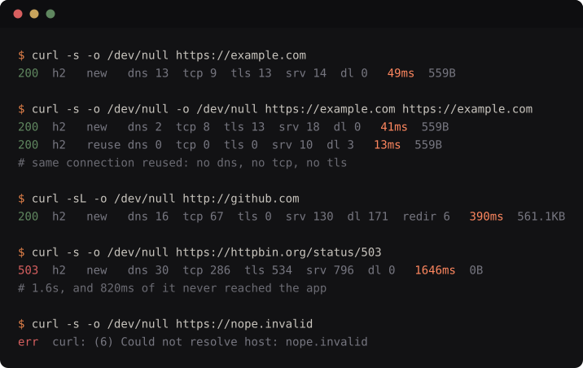
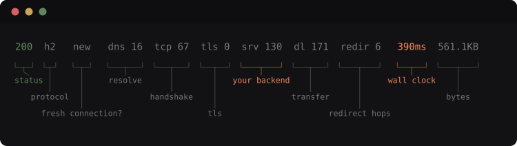

# wirestat

One dim line of HTTP timing after every `curl` you run. No flags, no wrapper
command, no dashboard.



## Reading a line



| Field | Meaning |
|---|---|
| `200` | HTTP status. Green 2xx, orange 3xx, red 4xx/5xx |
| `h2` | Negotiated protocol. A silent `h2` → `1.1` downgrade is usually a load balancer, not your client |
| `new` / `reuse` | Whether a fresh connection was opened. **The number that makes local benchmarks lie** — a reused connection skips DNS, TCP and TLS entirely. Separate `curl` processes never share a connection, so this reads `reuse` only within one invocation (`curl a b`) or against a keep-alive session |
| `dns` | Name resolution |
| `tcp` | TCP handshake — your geographic floor to that POP |
| `tls` | TLS handshake. Near zero on a resumed session; a full ~2-RTT handshake here every time means session resumption is not working |
| `srv` | Time to first byte after the connection was ready. **The part that is actually your backend** |
| `dl` | Body transfer |
| `redir` | Time spent on redirect hops, shown only when there were any. An `http://` base URL that 301s to `https://` pays a full extra connection here |
| `60ms` | Wall clock for the whole operation. The segments always sum to exactly this |
| `559B` | Bytes downloaded |

The split that matters most is `dns + tcp + tls` versus `srv`: network versus
your server. It tells you whose problem it is before you open a dashboard.

## What it's for

**Telling "the API is slow" apart from "the network is slow."** A 400ms call
where `srv` is 30ms is not a backend problem, and no amount of profiling your
handler will help. The reverse is just as common.

**Catching the benchmark that lies to you.** Every `curl` you type opens a
fresh connection, so you are timing DNS + TCP + TLS that your connection-pooled
production client never pays. When a line says `new` and the first three
phases are 90ms, you now know your loop test is measuring the wrong thing.

**Noticing the protocol quietly downgraded.** A service that reports `h2` in
staging and `1.1` in production is usually a load balancer, not your client —
and you would otherwise never look.

**Finding the redirect you forgot you had.** An `http://` base URL in a config
file 301s to `https://`, paying a whole extra connection and handshake on every
call. `redir` makes it visible the first time you hit the endpoint.

**Spotting TLS that never resumes.** A full handshake in `tls` on every single
request, instead of a near-zero resumed one, means session tickets are
misconfigured somewhere in the chain.

**Reading a failing request without re-running it with `-v`.** `err  curl: (6)`
tells you it was DNS, not a timeout, not a bad cert — on the first try.

**Sanity-checking a payload.** `dl` next to the byte count answers "is this
slow because it is big, or slow because it is far away", and an uncompressed
response tends to announce itself.

## Install

Requires **curl 7.75+** (`%{exitcode}` and `%{errormsg}`) and `awk`. On older
curl, wirestat detects it and stays out of the way.

### zsh

```sh
# antidote
antidote bundle rajksd01/wirestat

# zinit
zinit light rajksd01/wirestat

# oh-my-zsh
git clone https://github.com/rajksd01/wirestat \
  "${ZSH_CUSTOM:-$HOME/.oh-my-zsh/custom}/plugins/wirestat"
# then add wirestat to plugins=(...)
```

### bash

```sh
# bash-it
git clone https://github.com/rajksd01/wirestat \
  "$BASH_IT/custom/wirestat"

# plain bash
git clone https://github.com/rajksd01/wirestat ~/.wirestat
echo 'source ~/.wirestat/wirestat.sh' >> ~/.bashrc
```

### fish

```fish
# fisher
fisher install rajksd01/wirestat
```

## Controls

| | |
|---|---|
| `wirestat off` / `wirestat on` | toggle for the current shell |
| `WIRESTAT_DISABLE=1` | same, as an environment variable |
| `NO_COLOR=1` | plain output |
| `command curl ...` | run curl completely untouched |

wirestat prints **only when stdout is a terminal**. Piped, redirected and
scripted curl calls are byte-identical to bare curl — `curl -s $URL | jq .` is
unaffected. Calls using `-v`, `--trace*` or `--progress-bar` pass straight
through, since curl owns stderr for those.

The timing line goes to **stderr**, so it never contaminates a captured body.
A single invocation that fetches several URLs prints one line per transfer.

## How it works

A shell function shadows `curl`, appends a `-w` write-out template behind a
sentinel, replays curl's real stderr, and pipes the sentinel record through a
single awk renderer. All three shells share that one renderer.

curl's timing variables are more subtle than they look — see
[docs/timing-model.md](docs/timing-model.md).

## Regenerating the images

```sh
python3 docs/render-demo.py
```

## Tests

```sh
sh test/all.sh
```

Renderer unit tests plus integration tests that run real curl against a local
throwaway server in bash, zsh and fish. No network access required.

## License

MIT
